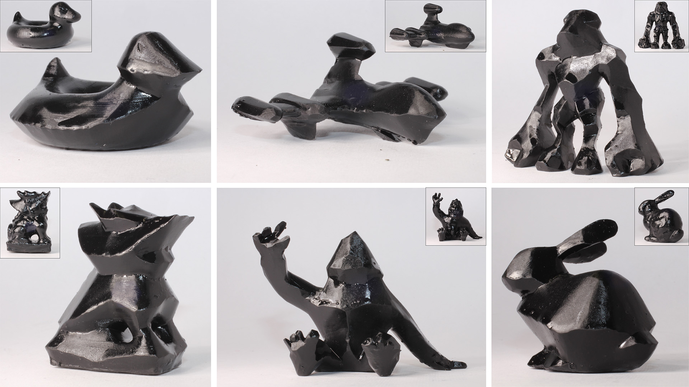

# Stealth Shaper



This is the official code release for the paper:

**Stealth Shaper: Reflectivity Optimization as Surface Stylization**\
[Kenji Tojo](https://kenji-tojo.github.io/), [Ariel Shamir](https://faculty.runi.ac.il/arik/site/index.asp), [Bernd Bickel](http://berndbickel.com/about-me), and [Nobuyuki Umetani](https://cgenglab.github.io/en/authors/admin/)\
In SIGGRAPH 2023\
**[[Project page](https://kenji-tojo.github.io/publications/stealthshaper/)]**

---
This code uses C++20 and was tested on Mac and Ubuntu.

## Installation
```
$ git clone --recursive https://github.com/kenji-tojo/stealth-shaper.git
```

## Running the code
The following commands
```
$ mkdir build && cd build
$ cmake -DCMAKE_BUILD_TYPE=Release ..
$ cmake --build . -j
```
will create the executable ```stealth-headless``` under ```build/```


Then, run
```
$ ./stealth-headless ../assets/bunny.obj
```
to perform our stealth optimization. The result will be saved as ```build/result/stealth.obj```.

The program will also save the intermediate shapes under ```build/result``` with ```-s``` flag.

## License
The software is free for personal use and non-commercial research conducted within non-commercial organizations. 
If you want to use it for commercial purposes, please contact us.

---
## More contents are comming soon!

